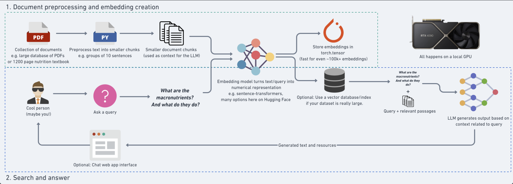

# Retireval Augmented Dietitian Chatbot 

This project, which is in progress, aims to create an emotionally conscious dietitian chatbot support system to help people with lifestyle diseases. Given a set of PDF or other formatted documents, the system will ingest, process, and store embeddings of any textual data, and add it to a corpus where it will be used as the knowledge base for the chatbot. Then, the embeddings are loaded, along with the user query which is also embedded, and passed onto a similarity search to retrieve the most relevant documents. The documents are then passed onto a LLM to generate a response, grounding the chatbot's reasoning. Make sure to run the scripts in a venv, with all the dependencies installed. Python version 3.10 or above is recommended.

## 🛠️ Technology Stack

- **LLM**: Meta's LLaMA 3.1 8B Instruct Model or other compatible models
- **Embedding Models**: 
  - Sentence Transformers (all-MiniLM-L6-v2)
  - MPNet (all-mpnet-base-v2)
- **Vector Stores**: 
  - ChromaDB
  - FAISS
  - A CSV file
- **PDF Processing**: PyMuPDF (fitz)
- **ML Framework**: PyTorch
- **NLP**: SpaCy

## 📋 Prerequisites

python
```pip install -r requirements.txt```

## 🌟 Features

- PDF document processing and chunking
- Efficient vector embeddings creation and storage
- Fast similarity search using FAISS
- State-of-the-art language generation using LLaMA 3.1
- Support for multiple GPU devices
- Persistent vector storage
- Configurable chunk sizes and overlap
- Robust error handling and logging



## 🚀 Usage

### 1. Index Documents

First, index your PDF documents:

For CSV file:
```python
python create_embeddings.py
```
For VectorDB:
'''python index_documents.py''' 

This script will:
- Process PDF documents
- Create text chunks with configurable size and overlap
- Generate embeddings
- Store them in ChromaDB or CSV file

### 2. Query the System

Basic usage:
'''python improved-model.py "Your query here"'''

Or load with AI server:
ssh @aiscalar ...

## 🏗️ Project Structure

- `model/index_documents.py`: PDF processing and document indexing
- `model/model.py`: Core RAG implementation with ChromaDB
- `model/improved-model.py`: Enhanced version using FAISS
- `model/create_embeddings.py`: Standalone embedding creation utility

## ⚙️ Configuration

Key parameters can be configured in the respective scripts:

- Maximum tokens per chunk
- Overlap tokens between chunks
- Number of results to retrieve
- Temperature for generation
- Maximum new tokens for response
- Embedding model selection

## 🎯 Performance Optimization

The system includes several optimizations:
- GPU acceleration when available
- Apple M1/M2 MPS support
- FAISS indexing for fast similarity search
- Efficient chunking with overlap
- Batch processing for embeddings

## 📝 License

This project is licensed under the MIT License - see the LICENSE file for details.

## Notes

- Consider chunking parameters based on your specific use case
- Model architecture is not final, and may change
- The project is still in progress and is not yet complete
- Web app is still under development, and may not work as expected


 